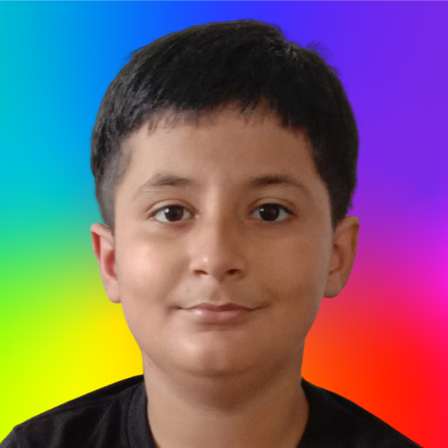

# **Hi, My Name is Shashwat Pritish 😀**

## I have a Youtube Channel [Pritish Academy]("https://www.youtube.com/@pritishacademy"). Please Subscribe it

## 🚀 About Me
I'm a full stack web and app developer...

I'm also a ML Engineer

## Frameworks that I have learned

- Django
- Flask
- Tensorflow
- Scikit-learn
- Textblob
- Kivy
- KivyMD
- Numpy
- Pandas
- Matplotlib
- OpenCV

and a lot more ...
