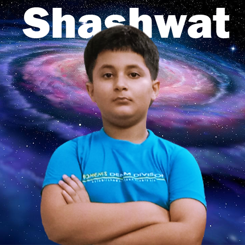

# Hi, My Name is Shashwat Pritish 😀

## I have a Youtube Channel [Pritish Academy]("https://www.youtube.com/@pritishacademy"). Please Subscribe it

## 🚀 About Me
I'm a full stack web and app developer...

I'm also a ML Engineer

## Frameworks that I have learned

